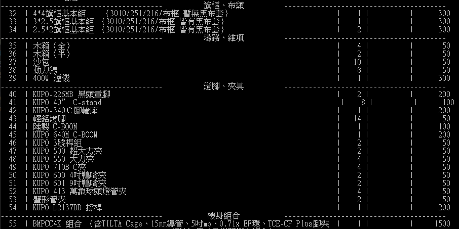

# Quotation-Generator
根據器材總表挑選並製作客製化器材清單的命令介面程式

# 使用方式
## 1. 添加器材資料
器材資料須存放於data資料夾中(若沒有請創建一個)，並且只接受CSV檔，各列由左至右的內容為：[項次,器材內容,數量,器材編號,未稅單價]。</br>
可依不同器材類型進行檔案之分類，同一類型的器材放在同一個檔案。</br>
### 檔名格式
<數字><空白><檔名>.csv</br>
例子：1 燈頭.csv</br>
程式會依據<數字>的數值大小，在顯示器材總表時排序不同種類的器材。</br>
如下圖為3 旗框、布類.csv、4 場務、雜項.csv、5 燈腳、夾具.csv及6 機身組合.csv之器材總表部分截圖，可看到<數字>越小之檔案在越上方。


## 2. 使用Python執行程式
### 指令
```
python3 ./quotation.py
python ./quotation.py
py ./quotation.py
```
擇一，不同電腦的指令可能不相同。</br>
也可製作成batch檔使用。

## 3. 開始使用程式
成功執行後，即依照程式指示開始使用。</br>
輸出檔案後，會生成一CSV檔，即可複製該資料至欲製作之器材報價單。

# 重要提醒
1. 本檔案為markdown語法，可於類似 https://markdownlivepreview.com/ 等支援markdown語法之閱讀器查看。
2. settings.py可以調整部分設定。